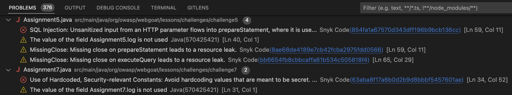
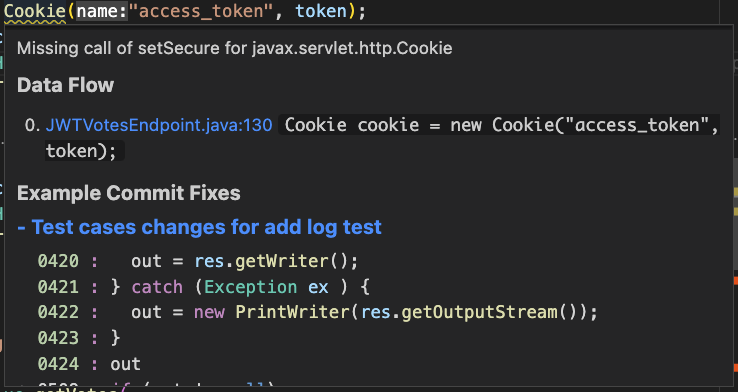
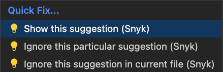

# Analysis results: Snyk Code

Snyk Code analysis shows security vulnerabilities and quality issues in your code with every scan.


Effective beginning on June 24, 2025, Snyk Code Quality issues will no longer be provided.


## Snyk Code vulnerability window

<figure><figcaption>
Snyk Code vulnerability window
</figcaption></figure>

The Snyk suggestion panel on the right of the results screen shows the Snyk Code Vulnerability name, the line it was found in, a suggestion for a fix, and an option to ignore, either in the entire file or a specific line.

On the **Problems** tab of the Visual Studio Code results screen, you can see all Code issues found in your Project.

<figure><figcaption>
Visual Studio Code Problems tab
</figcaption></figure>

Snyk also includes a feedback mechanism to report false positives so others do not see the same issue (bottom left).

## Snyk Code editor window

The vulnerabilities are visible within the editor, with the detailed information available on hover.

<figure><figcaption>
Snyk Code editor window
</figcaption></figure>

Choose **Quick Fix** to open the details panel for an issue using Code Action.

You can also choose to ignore a suggestion, either a particular one or a recurring one in the current file,  using **Quick Fix**.

<figure><figcaption>
Quick Fix menu
</figcaption></figure>

<figure><figcaption>
Ignore options with issue detail
</figcaption></figure>