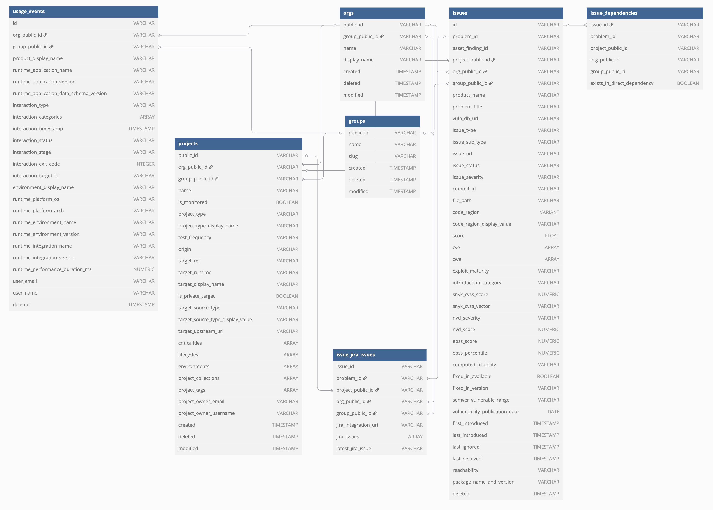
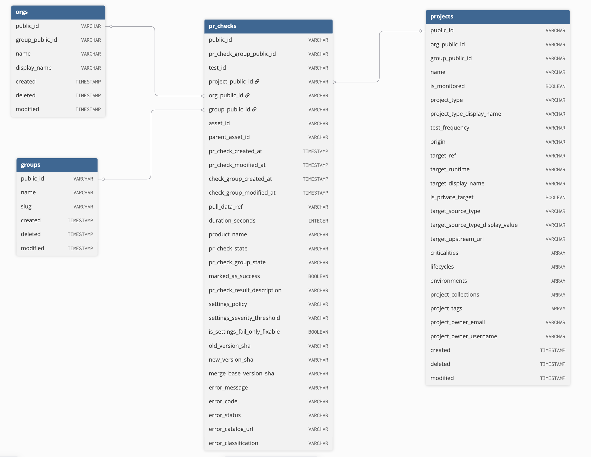
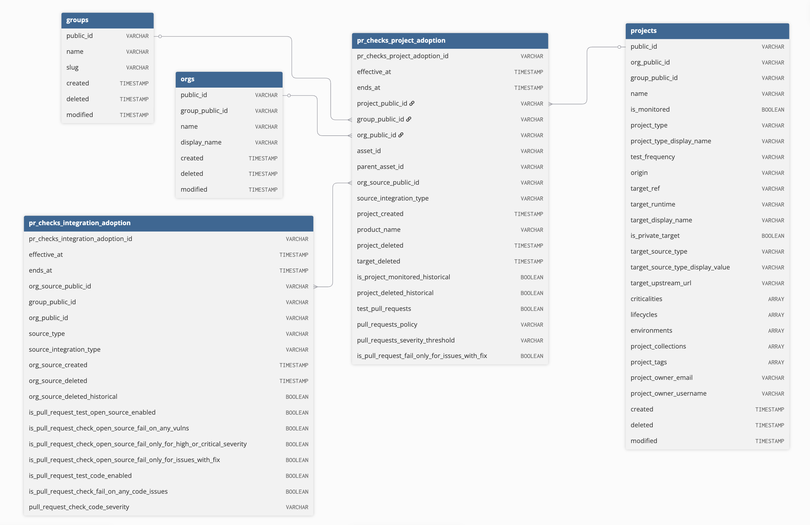
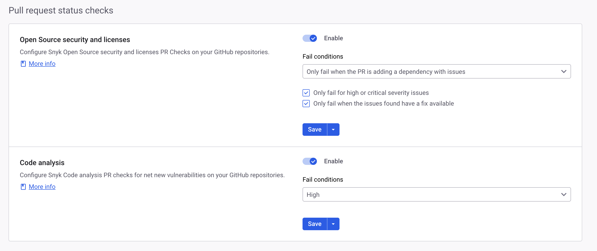
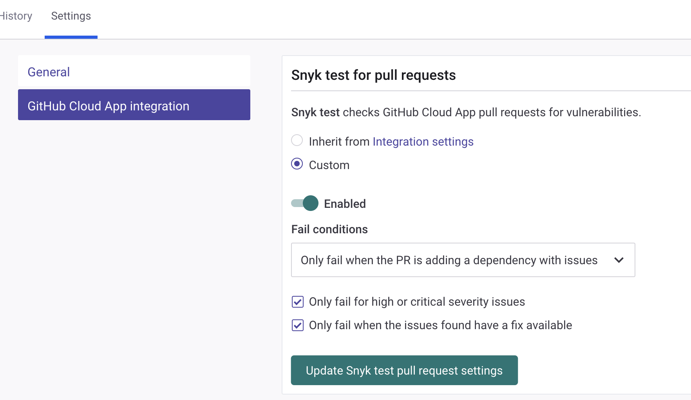

# Data Share data dictionary

Snyk Data Share is a comprehensive dataset encompassing various data pillars that support a wide range of use cases. You can use this dataset to present key security metrics such as issue backlog, aging, MTTR, SLA compliance, and test coverage, as well as to prioritize issues based on different factors, such as risk score, severity, CVSS, EPSS, and many more.

This dictionary is designed to help you navigate the dataset efficiently. It provides clear explanations of the purpose of each table and the specific data contained in each column, enabling you to leverage the dataset to meet your data reporting needs.

## Data Share Tables

The diagram above represents the objects listed in the data dictionary as a database diagram. It covers the following tables:

* [Groups](data-share-data-dictionary.md#groups)
* [Orgs](data-share-data-dictionary.md#orgs)
* [Projects](data-share-data-dictionary.md#projects)
* [Issues](data-share-data-dictionary.md#issues)
* [Dependencies](data-share-data-dictionary.md#dependencies)
* [Usage events](data-share-data-dictionary.md#usage-events)
* [Jira issues](data-share-data-dictionary.md#issue-jira-issues)
* [PR Checks](data-share-data-dictionary.md#pr-checks)
* [PR Checks Integration Adoption](data-share-data-dictionary.md#pr-checks-integration-adoption)
* [PR Checks Project Adoption](data-share-data-dictionary.md#pr-checks-project-adoption)

<figure><figcaption>
A database diagram defining the objects listed in the data dictionary related to issues
</figcaption></figure>

<figure><figcaption>
A database diagram defining the objects listed in the data dictionary related to PR checks
</figcaption></figure>

<figure><figcaption>
A database diagram defining the objects listed in the data dictionary related to PR check adoption
</figcaption></figure>

### Groups

> Version in use: v1.0

The `GROUPS` table contains the main attributes of Snyk Groups. This data can be utilized to perform aggregations on the Group level or zoom into the scope of specific groups.

| Column name    | Data type      | Description                                                                           |
| -------------- | -------------- | ------------------------------------------------------------------------------------- |
| `public_id`    | varchar        | A universally unique identifier for a Group, assigned in the records source database. |
| `display_name` | varchar        | The display name set for this group.                                                  |
| `slug`         | varchar        | The name of the Group within Snyk.                                                    |
| `created`      | timestamp\_ntz | When this record was created in Snyk.                                                 |
| `deleted`      | timestamp\_ntz | When this record was deleted from Snyk.                                               |
| `modified`     | timestamp\_ntz | When this record was last modified within Snyk.                                       |
| `__updated_at` | timestamp\_ntz | When the data share data transformation last updated this record.                     |

### Orgs

> Version in use: v1.0

The `ORGS` table contains the main attributes of Snyk Organizations. This data can be utilized to perform aggregations on the organizational level or to zoom into the scope of specific organizations.


The `group_public_id` column allows you to query organizations in specific groups.


| Column name       | Data type      | Description                                                                                   |
| ----------------- | -------------- | --------------------------------------------------------------------------------------------- |
| `public_id`       | varchar        | A universally unique identifier for an organization, assigned in the records source database. |
| `group_public_id` | varchar        | A universally unique identifier for a group, assigned in the records source database.         |
| `display_name`    | varchar        | The display name set for this organization.                                                   |
| `slug`            | varchar        | The name for the Organization within Snyk.                                                    |
| `created`         | timestamp\_ntz | When this record was created in Snyk.                                                         |
| `deleted`         | timestamp\_ntz | When this record was deleted from Snyk.                                                       |
| `modified`        | timestamp\_ntz | When this record was last modified within Snyk.                                               |
| `__updated_at`    | timestamp\_ntz | When the data share data transformation last updated this record.                             |

### Projects

> Version in use: v1.0

ProjectThe `PROJECTS` table contains the main attributes of Snyk Projects and the related target. Its data can be utilized for performing aggregations of filters on the Project or target levels, including based on Project collections, Project tags, or specific repo branches (using `target_ref`).


Snyk Reports only presents monitored projects that were not deleted. To match your results with Snyk Reports, filter your query with `IS_MONITORED = TRUE` and `DELETE IS NULL.`


| Column name                        | Data type      | Description                                                                                                                                                                                                                                |
| ---------------------------------- | -------------- | ------------------------------------------------------------------------------------------------------------------------------------------------------------------------------------------------------------------------------------------ |
| `public_id`                        | varchar        | A universally unique identifier for a project, assigned in the record's source database.                                                                                                                                                   |
| `org_public_id`                    | varchar        | A universally unique identifier for an organisation, assigned in the record's source database.                                                                                                                                             |
| `group_public_id`                  | varchar        | A universally unique identifier for a group, assigned in the record's source database.                                                                                                                                                     |
| `name`                             | varchar        | The name given to this project, when added to Snyk.                                                                                                                                                                                        |
| `is_monitored`                     | boolean        | Whether this project is currently set to be actively monitored.                                                                                                                                                                            |
| `project_type`                     | varchar        | The scanning method to use for a particular Project, such as Static Application Security Testing (SAST) for scanning using Snyk Code, or Maven for a Maven project using Snyk Open Source. This is part of the configuration for scanning. |
| `project_type_display_name`        | varchar        | A display name Snyk assigned to internal project type values.                                                                                                                                                                              |
| `test_frequency`                   | varchar        | The frequency of testing for a given Project. For example, Daily, Weekly, and so on.                                                                                                                                                       |
| `origin`                           | varchar        | The Origin defines the Target ecosystem, such as CLI, GitHub, or Kubernetes. Origins are a property of Targets.                                                                                                                            |
| `target_ref`                       | varchar        | A reference that differentiates this project, for example, a branch name or version. Projects having the same reference can be grouped based on that reference.                                                                            |
| `target_runtime`                   | varchar        | The environment in which the Target is executed and run.                                                                                                                                                                                   |
| `target_display_name`              | varchar        | A display name for a project's target.                                                                                                                                                                                                     |
| `is_private_target`                | boolean        | Whether the target's source is private or publicly reachable.                                                                                                                                                                              |
| `target_source_type`               | varchar        | The hosting provider of a given target, for example, docker-hub, github, and so on.                                                                                                                                                        |
| `target_source_type_display_value` | varchar        | A display value that represents the grouping for target sources, for example, Source Control, Container Registry, and so on.                                                                                                               |
| `target_upstream_url`              | varchar        | The URL pointing to a target's upstream source, such as a URL for a GitHub repository.                                                                                                                                                     |
| `target_file`                      | varchar        | The full file path within a project that Snyk is targeting for security scanning, such as /var/www/composer.lock, /app/package.json, or other dependency manifest files.                                                                   |
| `criticalities`                    | array          | A project attribute that indicates business criticality. For example, low, medium, high, critical.                                                                                                                                         |
| `lifecycles`                       | array          | A project attribute, for example, production, development, sandbox.                                                                                                                                                                        |
| `environments`                     | array          | A project attribute, for example, frontend, backend, internal, external, mobile, saas, onprem, hosted, distributed.                                                                                                                        |
| `project_collections`              | array          | All Project collections to which this project has been added.                                                                                                                                                                              |
| `project_tags`                     | array          | All tags which have been assigned to this project.                                                                                                                                                                                         |
| `project_owner_email`              | varchar        | The email of the user assigned as the owner of this project.                                                                                                                                                                               |
| `project_owner_username`           | varchar        | The username of the user assigned as the owner of this project.                                                                                                                                                                            |
| `created`                          | timestamp\_ntz | When this record was created in Snyk.                                                                                                                                                                                                      |
| `deleted`                          | timestamp\_ntz | When this record was deleted from Snyk.                                                                                                                                                                                                    |
| `modified`                         | timestamp\_ntz | When this record was last modified within Snyk.                                                                                                                                                                                            |
| `__updated_at`                     | timestamp\_ntz | When the data share data transformation last updated this record.                                                                                                                                                                          |

### Issues

> Version in use: v1.0

The `ISSUES` table contains various attributes of Snyk Issues. Issues can be easily correlated with their originating Project, target, Organization or Group, utilizing the corresponding ID columns. On top of the issue's basic attributes, such as its introduction date, type, severity, score, there are columns that elaborate on the vulnerability attributes, such as the CVSS score, EPSS Score, NVD Score.

Querying the issues table allows:

* Concluding various metrics and KPIs, among issue backlog, aging, MTTR and SLA compliance.
* Visualizing trends of identified, ignored, and resolved issues over time
* Prioritize issues based on multiple factors and considerations


If you would like to match your results with Snyk Reports:

* Filter your query with `DELETED_AT IS NULL`, as Snyk Reports do not present deleted issues.
* Join the Issues table with the Projects table and filter by `IS_MONITORED = TRUE`, as Snyk Reports does not present issues of deactivated Projects.


| Column name                      | Data type      | Description                                                                                                                                                                                                                       |
| -------------------------------- | -------------- | --------------------------------------------------------------------------------------------------------------------------------------------------------------------------------------------------------------------------------- |
| `asset_finding_id`               | varchar        | A unique issue ID in the level of repository, only applicable for Snyk Code issue                                                                                                                                                 |
| `code_region`                    | varchar        | The line numbers and columns range where the issues was found within a file                                                                                                                                                       |
| `code_region_display_value`      | varchar        | The display representation of the line numbers and columns range where the issues was found within a file.                                                                                                                        |
| `commit_id`                      | varchar        | Refers to the unique ID that Git assigns to commits so those can be uniquely identified. Currently, Snyk provide Commit ID only for Snyk Code issues                                                                              |
| `computed_fixability`            | varchar        | Indicates whether the issue can be fixed based on the vulnerability remediation paths.                                                                                                                                            |
| `cve`                            | array          | CVE ID(s                                                                                                                                                                                                                          |
| `cwe`                            | array          | CWE ID(s)                                                                                                                                                                                                                         |
| `deleted_at`                     | timestamp\_ntz | When this record was deleted from Snyk.                                                                                                                                                                                           |
| `epss_percentile`                | number         | The proportion of all vulnerabilities with the same or lower EPSS score.                                                                                                                                                          |
| `epss_score`                     | number         | The probability of exploitation in the wild in the next 30 days.                                                                                                                                                                  |
| `exploit_maturity`               | varchar        | Represents the existence and maturity of public exploits validated by Snyk, as defined by Snyk. Values: No data, No known exploit, Proof of concept, Mature.                                                                      |
| `exploit_maturity_cvss_v4`       | varchar        | Represents the existence and maturity of public exploits validated by Snyk, as defined by [CVSS v4.0](https://www.first.org/cvss/v4-0/specification-document#Exploit-Maturity-E). Values: Not Defined, Proof of Concept, Attacked |
| `file_path`                      | varchar        | The path to the file where Snyk Code identified the specific issue.                                                                                                                                                               |
| `first_introduced`               | timestamp\_ntz | The timestamp of the first scan that identified the issue.                                                                                                                                                                        |
| `fixed_in_available`             | boolean        | Is the given vulnerability fixed in a different version of responsible source.                                                                                                                                                    |
| `fixed_in_version`               | variant        | The first version in which a given vulnerability was fixed.                                                                                                                                                                       |
| `group_public_id`                | varchar        | A universally unique identifier for a group, assigned in the record's source database.                                                                                                                                            |
| `id`                             | varchar        | A unique identifier, representing a unique instance of a given security issue in a project.                                                                                                                                       |
| `introduction_category`          | varchar        | A Snyk generated classification describing the nature of an issue's introduction in the context of Snyk product usage, for example, Baseline Issue, Non Preventable Issue, Preventable Issue.                                     |
| `issue_severity`                 | varchar        | Indicates the assessed level of risk, as Critical, High, Medium, or Low.                                                                                                                                                          |
| `issue_status`                   | varchar        | Indicates whether the issue is open, resolved, or ignored.                                                                                                                                                                        |
| `issue_sub_type`                 | varchar        | A more granular variation of issue type.                                                                                                                                                                                          |
| `issue_type`                     | varchar        | Indicates whether the issue is related to a vulnerability, license, or configuration.                                                                                                                                             |
| `issue_url`                      | varchar        | URL which directs to the given's project's instance of this vulnerability on the Snyk Website.                                                                                                                                    |
| `last_ignored`                   | timestamp\_ntz | The most recent instance of an issue having been ignored within Snyk's product.                                                                                                                                                   |
| `last_introduced`                | timestamp\_ntz | The most recent instance of an issue having been introduced (or reintroduced).                                                                                                                                                    |
| `last_resolved`                  | timestamp\_ntz | The most recent instance of an issue having been resolved.                                                                                                                                                                        |
| `nvd_score`                      | number         | The vulnerability's score as calculated by NVD.                                                                                                                                                                                   |
| `nvd_severity`                   | varchar        | The vulnerability's severity as rated by NVD.                                                                                                                                                                                     |
| `org_public_id`                  | varchar        | A universally unique identifier for an organization, assigned in the record's source database.                                                                                                                                    |
| `package_name_and_version`       | varchar        | The vulnerability's associated package name and version.                                                                                                                                                                          |
| `problem_id`                     | varchar        | Snyk Vulnerability database ID that uniquely identifies the vulnerability.                                                                                                                                                        |
| `problem_title`                  | varchar        | Name of the Snyk discovered vulnerability.                                                                                                                                                                                        |
| `product_name`                   | varchar        | The Snyk Product which initially identified this issue.                                                                                                                                                                           |
| `project_public_id`              | varchar        | A universally unique identifier for a project, assigned in the record's source database.                                                                                                                                          |
| `reachability`                   | varchar        | Indicates whether the issue is related to functions that are being called by the application and thus has a greater risk of exploitability.                                                                                       |
| `score`                          | float          | A score based on an analysis model. Priority score is released in General Availability, while Risk Score is in Early Access.                                                                                                      |
| `semver_vulnerable_range`        | variant        | The vulnerable range of package versions (based on semantic versioning).                                                                                                                                                          |
| `snyk_cvss_score`                | number         | Snyk's recommended Common Vulnerability Scoring System (CVSS) score.                                                                                                                                                              |
| `snyk_cvss_vector`               | varchar        | The vector string of the metric values used to determine the CVSS score.                                                                                                                                                          |
| `vulnerability_publication_date` | date           | The date a given vulnerability was first published by Snyk.                                                                                                                                                                       |
| `vuln_db_url`                    | varchar        | URL which directs to the Snyk's Public Vulnerability Database website.                                                                                                                                                            |
| `__updated_at`                   | timestamp\_ntz | When the data share data transformation last updated this record.                                                                                                                                                                 |

### Dependencies

> Version in use: v1.0

The `Dependencies` table allows you to identify issues based on their availability in direct dependencies.

| Column name                   | Data type | Description                                                                                                                       |
| ----------------------------- | --------- | --------------------------------------------------------------------------------------------------------------------------------- |
| `issue_id`                    | varchar   | A unique identifier, representing a unique instance of a given security issue in a project.                                       |
| `problem_id`                  | varchar   | Snyk Vulnerability database ID that uniquely identifies the vulnerability.                                                        |
| `project_public_id`           | varchar   | A universally unique identifier for a project, assigned in the record's source database.                                          |
| `org_public_id`               | varchar   | A universally unique identifier for an organization, assigned in the record's source database.                                    |
| `group_public_id`             | varchar   | A universally unique identifier for a group, assigned in the record's source database.                                            |
| `exists_in_direct_dependency` | boolean   | Indicates if the vulnerability exists in a direct dependency. If false, the vulnerability only exists in transitive dependencies. |

### Usage Events

> Version in use: v1.0

The `USAGE_EVENTS` table contains CLI interaction data that is collected from Snyk's CLI interfaces (CLI, IDE plugins, CI/CD pipeline tools). The CLI interaction events can be correlated with the execution context, such as their target, Organization, or Group, utilizing the corresponding ID columns.

Querying the `USAGE_EVENTS` table allows you to measure:

* Developers' usage and adoption of Snyk IDE plugins
* Snyk tests in CI/CD pipelines
* Snyk CLI utilization per the different commands: test, monitor, SBOM, etc.

| Column name                               | Data type      | Description                                                                                                                                                                                                                                                                                                                          |
| ----------------------------------------- | -------------- | ------------------------------------------------------------------------------------------------------------------------------------------------------------------------------------------------------------------------------------------------------------------------------------------------------------------------------------ |
| `id`                                      | varchar        | A unique identifier for an interaction event                                                                                                                                                                                                                                                                                         |
| `org_public_id`                           | varchar        | A universally unique identifier for an organization, assigned in the record's source database.                                                                                                                                                                                                                                       |
| `group_public_id`                         | varchar        | A universally unique identifier for a group, assigned in the record's source database.                                                                                                                                                                                                                                               |
| `product_display_name`                    | varchar        | The Snyk product used during this interaction, for example, Snyk Open Source, Snyk IaC, Snyk Code, Snyk Container.                                                                                                                                                                                                                   |
| `runtime_application_name`                | varchar        | The application used to execute a snyk interaction, for example, PyCharm, Visual Studio, snyk-ls, snyk-cli.                                                                                                                                                                                                                          |
| `runtime_application_version`             | varchar        | The version of the integration.                                                                                                                                                                                                                                                                                                      |
| `runtime_application_data_schema_version` | varchar        | The data schema version of Snyk's runtime interactions. The current version (v2) was released in Q2 2024. Prior versions' data may behave differently.                                                                                                                                                                               |
| `interaction_type`                        | varchar        | The type of interaction, could be **Scan done**. **Scan Done** indicates that a test was run no matter if the CLI or IDE ran it, other types can be freely chosen types.                                                                                                                                                             |
| `interaction_categories`                  | array          | The category vector used to describe the interaction in detail, for example, **oss**,**test**.                                                                                                                                                                                                                                       |
| `interaction_timestamp`                   | array          | When the interaction was started in UTC.                                                                                                                                                                                                                                                                                             |
| `interaction_status`                      | timestamp\_ntz | Status would be **success** or **failure**, where **success** means the action was executed, while **failure** means it didn't run.                                                                                                                                                                                                  |
| `interaction_stage`                       | varchar        | The stage of the SDLC where the interaction occurred, such as "dev"\|"cicd"\|"prchecks"\|"unknown".                                                                                                                                                                                                                                  |
| `interaction_exit_code`                   | integer        | The interaction's exit code as returned by the running process. More info about the exit codes and their meaning is available in Snyk Docs per a given interaction (test, monitor, etc.)                                                                                                                                             |
| `interaction_target_id`                   | varchar        | A purl is a URL composed of seven components. scheme:type/namespace/name@version?qualifiers#subpath The purl specification is available here: `https://github.com/package-url/purl-spec` Some purl examples `pkg:github/package-url/purl-spec@244fd47e07d1004f0aed9c` `pkg:npm/%40angular/animation@12.3.1` `pkg:pypi/django@1.11.1` |
| `environment_display_name`                | varchar        | The Environment used during this interaction, for example, CLI, Eclipse, Jetbrains IDE, Visual Studio, Visual Studio Code, or Other                                                                                                                                                                                                  |
| `runtime_platform_os`                     | varchar        | The operating system for the integration (darwin, windows, linux, and so on).                                                                                                                                                                                                                                                        |
| `runtime_platform_arch`                   | varchar        | The architecture for the integration (AMD64, ARM64, 386, ALPINE).                                                                                                                                                                                                                                                                    |
| `runtime_environment_name`                | varchar        | The environment for the integration (for example, IntelliJ Ultimate, Pycharm).                                                                                                                                                                                                                                                       |
| `runtime_environment_version`             | varchar        | The version of the integration environment (for example, 2023.3)                                                                                                                                                                                                                                                                     |
| `runtime_integration_name`                | varchar        | The name of the integration, could be a plugin or extension.                                                                                                                                                                                                                                                                         |
| `runtime_integration_version`             | varchar        | The version of the integration, for example: 2.3.4.                                                                                                                                                                                                                                                                                  |
| `runtime_performance_duration_ms`         | number         | The duration in milliseconds of the interaction                                                                                                                                                                                                                                                                                      |
| `user_email`                              | varchar        | The email of the user who was authenticated during the interaction.                                                                                                                                                                                                                                                                  |
| `user_name`                               | varchar        | The name of the user who was authenticated during the interaction.                                                                                                                                                                                                                                                                   |
| `__updated_at`                            | timestamp\_ntz | When the data share data transformation last updated this record.                                                                                                                                                                                                                                                                    |

### Issue Jira Issues

> Version in use: v1.0

The `ISSUE_JIRA_ISSUES` table allows correlation between Snyk issues and assigned Jira issues. As Snyk enables more than one type of Jira integration, it is important to emphasize that the Jira issues that are available in the dataset originated from this [Jira integration](../../../../integrations/jira-and-slack-integrations/jira-integration.md).

| Column name            | Data type      | Description                                                                                    |
| ---------------------- | -------------- | ---------------------------------------------------------------------------------------------- |
| id                     | varchar        | A unique identifier, representing a unique instance of a given vulnerability in a project.     |
| `problem_id`           | varchar        | Snyk Vulnerability Database ID that uniquely identifies the vulnerability.                     |
| `project_public_id`    | varchar        | A universally unique identifier for a project, assigned in the record's source database.       |
| `org_public_id`        | varchar        | A universally unique identifier for an organization, assigned in the record's source database. |
| `group_public_id`      | varchar        | A universally unique identifier for a group, assigned in the record's source database.         |
| `jira_integration_uri` | varchar        | The URL of the Jira account provided to the Snyk Jira integration.                             |
| `jira_issues`          | array          | An array of all Jira Issues ever created for this issue.                                       |
| `latest_jira_issue`    | varchar        | The most recently created Jira Issue for this issue.                                           |
| `__updated_at`         | timestamp\_ntz | When the data share data transformation last updated this record.                              |

### PR Checks

> Version in use: v1.0

The `PR_CHECKS` table contains data for all your [automated Snyk pull request (PR) checks](../../../../scan-with-snyk/pull-requests/pull-request-checks/configure-pull-request-checks.md). Use this data to track your check pass rate over time and identify repositories driving the most failed checks.

The table includes attributes for:

* Overridden check results
* Additional error details
* Active PR check settings when each check ran

PR check groups represent each time Snyk runs PR checks on a specific pull request for a given product, for example, Snyk Open Source or Snyk Code. Snyk triggers PR checks multiple times while a PR is open. A group contains multiple open-source checks when the target repository has dependencies across multiple languages.


If you would like to match your results with Snyk Reports:

* Join the PR Checks table with the Projects table and filter by `IS_MONITORED = TRUE` and project `DELETED IS NULL`, as Snyk Reports does not present PR checks of deactivated or deleted Projects.
* Aggregate results based on the `pr_check_group_id` and the `pr_check_group_state`


<table><thead><tr><th width="278.2109375">Column name</th><th width="243.078125">Data type</th><th>Description</th></tr></thead><tbody><tr><td><code>public_id</code></td><td>varchar</td><td>A universally unique identifier for a PR Check, assigned in the records source database.</td></tr><tr><td><code>pr_check_group_id</code></td><td>varchar</td><td>Identifier of the parent pull request check group.</td></tr><tr><td><code>test_id</code></td><td>varchar</td><td>Identifier of the test results associated with the test-service.</td></tr><tr><td><code>project_public_id</code></td><td>varchar</td><td>A universally unique identifier for a project, assigned in the record's source database.</td></tr><tr><td><code>org_public_id</code></td><td>varchar</td><td>A universally unique identifier for an organization, assigned in the record's source database.</td></tr><tr><td><code>group_public_id</code></td><td>varchar</td><td>A universally unique identifier for a group, assigned in the record's source database.</td></tr><tr><td><code>asset_id</code></td><td>varchar</td><td>Identifier of the asset linked to the project.</td></tr><tr><td><code>parent_asset_id</code></td><td>varchar</td><td>Identifier of the repository parent asset linked to the project.</td></tr><tr><td><code>pr_check_created_at</code></td><td>timestamp_ntz</td><td>Timestamp when the pull request check was created.</td></tr><tr><td><code>pr_check_modified_at</code></td><td>timestamp_ntz</td><td>Timestamp when the pull request check was last updated.</td></tr><tr><td><code>check_group_created_at</code></td><td>timestamp_ntz</td><td>Timestamp when the parent check group was created.</td></tr><tr><td><code>check_group_modified_at</code></td><td>timestamp_ntz</td><td>Timestamp when the parent check group was last updated.</td></tr><tr><td><code>product_name</code></td><td>varchar</td><td>The Snyk Product associated with the check (for example, Snyk Open Source, Snyk Code).</td></tr><tr><td><code>pr_check_state</code></td><td>varchar</td><td>The check status for the particular product type. The status will be <strong>success</strong> if the check passed under the policy settings in force and <strong>failure</strong> if an issue violating the policy was found. An <strong>error</strong> status indicates there was a problem running the check.</td></tr><tr><td><code>pr_check_group_state</code></td><td>varchar</td><td>The status for the parent check group.</td></tr><tr><td><code>marked_as_success</code></td><td>boolean</td><td>True if the check failed due to a policy violation but the result was manually overridden by a user. This allows PRs to be merged despite security findings.</td></tr><tr><td><code>pr_check_result_description</code></td><td>varchar</td><td>Summary of the check results.</td></tr><tr><td><code>settings_policy</code></td><td>varchar</td><td>Description of the policy applied to the check run (e.g. <code>only_new</code> vs <code>all</code>).</td></tr><tr><td><code>settings_severity_threshold</code></td><td>varchar</td><td>Settings for the severity threshold at which the pull request check fails.</td></tr><tr><td><code>is_settings_fail_only_fixable</code></td><td>boolean</td><td>Flag indicating if the check was configured to fail only on fixable issues.</td></tr><tr><td><code>old_version_sha</code></td><td>varchar</td><td>Commit SHA for the base revision used in the scan.</td></tr><tr><td><code>new_version_sha</code></td><td>varchar</td><td>Commit SHA for the head revision used in the scan.</td></tr><tr><td><code>merge_base_version_sha</code></td><td>varchar</td><td>Commit SHA for the merge base between the compared revisions.</td></tr><tr><td><code>pull_data_ref</code></td><td>varchar</td><td>Reference of the pull request that triggered the check.</td></tr><tr><td><code>error_message</code></td><td>varchar</td><td>Human-readable error message when the check resulted in an error state.</td></tr><tr><td><code>error_code</code></td><td>varchar</td><td>Snyk error catalog code identifying the type of error (for example, SNYK-PR-CHECK-0009).</td></tr><tr><td><code>error_status</code></td><td>varchar</td><td>HTTP status code associated with the error.</td></tr><tr><td><code>error_catalog_url</code></td><td>varchar</td><td>URL to the Snyk error catalog documentation page for the specific error code.</td></tr><tr><td><code>error_classification</code></td><td>varchar</td><td><code>ACTIONABLE</code> indicates that the input is not in a format or state usable by Snyk, but there are steps you can take to resolve the issue. <code>UNSUPPORTED</code> indicates that Snyk cannot handle the data sent. For example, a project that uses a version of Python that is no longer supported.</td></tr><tr><td><code>__updated_at</code></td><td>timestamp_ntz</td><td>When the data share data transformation last updated this record.</td></tr></tbody></table>

### PR Checks Integration Adoption

> Version in use: v1.0

Use the `PR_CHECK_INTEGRATION_ADOPTION` table to track pull request check integration adoption over time.

This table tracks how organizations configure pull request checks for each integration, for example, GitHub Cloud App and Azure Repos. It also records whether organizations enable these checks for each available Snyk product.

Each row represents an effective period defined by the `effective_at` and `ends_at` columns:

* Snyk creates a new row whenever settings change.
* Rows where `ends_at` is `null` represent the current configuration.

<figure><figcaption>
PR check settings tracked in the <code>PR_CHECK_INTEGRATION_ADOPTION</code> table
</figcaption></figure>

| Column name                                                                 | Data type      | Description                                                                                                  |
| --------------------------------------------------------------------------- | -------------- | ------------------------------------------------------------------------------------------------------------ |
| `pr_checks_integration_adoption_id`                                         | varchar        | Key uniquely identifying this historical integration PR checks adoption settings period.                     |
| `effective_at`                                                              | timestamp\_ntz | Timestamp when this integration PR check configuration state became effective.                               |
| `ends_at`                                                                   | timestamp\_ntz | Timestamp when this integration PR check configuration state ended, null if currently active.                |
| `org_source_public_id`                                                      | varchar        | UUID for the organization source (integration).                                                              |
| `group_public_id`                                                           | varchar        | UUID for the integration's owning group.                                                                     |
| `org_public_id`                                                             | varchar        | UUID for the integration's owning organization.                                                              |
| `source_type`                                                               | varchar        | Type of the source (for example, github, gitlab, bitbucket).                                                 |
| `source_integration_type`                                                   | varchar        | Type of source integration (for example, scm).                                                               |
| `org_source_created`                                                        | timestamp\_ntz | Timestamp when the integration for the organization was created.                                             |
| `org_source_deleted`                                                        | timestamp\_ntz | Timestamp when the integration for the organization was deleted, null if not deleted.                        |
| `org_source_deleted_historical`                                             | boolean        | Historical flag indicating if the integration for the organization was deleted during this effective period. |
| `is_pull_request_test_open_source_enabled`                                  | boolean        | Flag indicating if open source PR checks are enabled for the integration.                                    |
| `is_pull_request_check_open_source_fail_on_any_vulns`                       | boolean        | Flag indicating if PR checks fail on any open source vulnerabilities vs. only new.                           |
| `is_pull_request_check_open_source_fail_only_for_high_or_critical_severity` | boolean        | Flag indicating if PR checks only fail for high or critical severity open source issues.                     |
| `is_pull_request_check_open_source_fail_only_for_issues_with_fix`           | boolean        | Flag indicating if PR checks only fail for open source issues with available fixes.                          |
| `is_pull_request_test_code_enabled`                                         | boolean        | Flag indicating if code PR checks are enabled for the integration.                                           |
| `pull_request_check_code_severity`                                          | varchar        | Severity threshold for code PR checks.                                                                       |
| `__updated_at`                                                              | timestamp\_ntz | When the data share data transformation last updated this record.                                            |

### PR Checks Project Adoption

> Version in use: v1.0

The `PR_CHECK_PROJECT_ADOPTION` table tracks pull request (PR) check configurations for specific projects with project-level overrides. Join this table with the PR Checks Integration Adoption table using `org_source_public_id` to determine the active settings for each project and target repository over time.

**Table behavior:**

* Snyk creates a new row when settings change.
* The `effective_at` and `ends_at` columns define the effective period for each row.
* Rows with a null `ends_at` value represent the current configuration.
* If `test_pull_requests` is null, no project-level overrides exist. The integration determines the settings.

<figure><figcaption>
PR check settings tracked in the <code>PR_CHECK_PROJECT_ADOPTION</code> table
</figcaption></figure>

| Column name                                     | Data type      | Description                                                                                                                                          |
| ----------------------------------------------- | -------------- | ---------------------------------------------------------------------------------------------------------------------------------------------------- |
| `pr_checks_project_adoption_id`                 | varchar        | Key uniquely identifying this historical project PR checks adoption settings period.                                                                 |
| `effective_at`                                  | timestamp\_ntz | Timestamp when this project configuration state became effective.                                                                                    |
| `ends_at`                                       | timestamp\_ntz | Timestamp when this project configuration state ended, null if currently active.                                                                     |
| `project_public_id`                             | varchar        | UUID for the project, assigned in the record's source database.                                                                                      |
| `group_public_id`                               | varchar        | UUID for the project's owning group.                                                                                                                 |
| `org_public_id`                                 | varchar        | UUID for the project's owning organization.                                                                                                          |
| `asset_id`                                      | varchar        | Identifier of the asset linked to the project.                                                                                                       |
| `parent_asset_id`                               | varchar        | Identifier of the repository parent asset linked to the project.                                                                                     |
| `org_source_public_id`                          | varchar        | UUID for the organization source (integration) linked to the project.                                                                                |
| `source_integration_type`                       | varchar        | Type of source integration (for example, scm).                                                                                                       |
| `project_created`                               | timestamp\_ntz | Timestamp when the project was created.                                                                                                              |
| `product_name`                                  | varchar        | The Snyk Product associated with the project.                                                                                                        |
| `project_deleted`                               | timestamp\_ntz | Timestamp when the project was deleted, if applicable.                                                                                               |
| `target_deleted`                                | timestamp\_ntz | Timestamp when the target containing the project was deleted, if applicable.                                                                         |
| `is_project_monitored_historical`               | boolean        | Historical flag indicating if the project was monitored during this historical period.                                                               |
| `project_deleted_historical`                    | boolean        | Historical flag from registry indicating if the project was deleted during this period.                                                              |
| `test_pull_requests`                            | boolean        | Flag indicating if PR testing is enabled for the project, will be null if inheriting from integration settings.                                      |
| `pull_requests_policy`                          | varchar        | Policy for PR checks setting (for example, only\_new, all), will be null if inheriting from integration settings.                                    |
| `pull_requests_severity_threshold`              | varchar        | Severity threshold at which PR checks are set to fail, will be null if inheriting from integration settings.                                         |
| `is_pull_request_fail_only_for_issues_with_fix` | boolean        | Flag indicating if open-source PR checks are only set to fail for issues with available fixes, will be null if inheriting from integration settings. |
| `__updated_at`                                  | timestamp\_ntz | When the data share data transformation last updated this record.                                                                                    |
