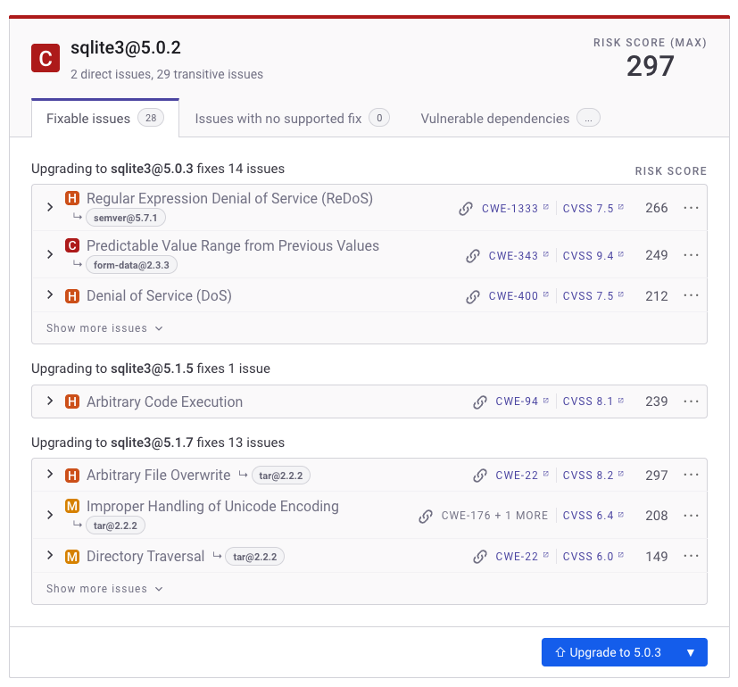

# Snyk Pull or Merge Requests

In addition to providing fix advice, Snyk enables you create automatic or manual pull requests for supported package managers and ecosystems. To create PRs automatically in implementations with Snyk Broker, your administrator must upgrade to v4.55.0 or later.


For the basic steps in fixing vulnerabilities, see [Fix your vulnerabilities](../../snyk-open-source/manage-vulnerabilities/fix-your-vulnerabilities.md). To ensure your language is supported, see [Languages supported for Fix Pull Requests or Merge Requests](../../snyk-open-source/manage-vulnerabilities/troubleshoot-fixing-vulnerabilities-with-snyk-open-source.md#languages-supported-for-fix-pull-requests-or-merge-requests) and [Supported browsers](../../../discover-snyk/getting-started/#supported-browsers) pages.



Administrators and account owners can manage the settings for Snyk upgrade pull requests from the Snyk Web UI at both the Organization and Project levels. You can configure whether the feature is enabled (the default) and specify the conditions under which Snyk should submit upgrade pull requests, if at all.


## Manual Fix PRs

For specific supported languages, you can create pull requests to remediate issues using the Snyk web UI. These combine Snyk fix advice with the list of remediated vulnerabilities to create a pull request that developers can review and merge into their repo's main branch.

You can start the process from any supported Project's open source vulnerability view.

<figure><figcaption>
Vulnerability view of an issue 
</figcaption></figure>


PRs use a branch naming convention based on the issues they fix. If a PR already exists for a specific change, Snyk does not create a new one, even if you closed the original PR.

If you try to create a duplicate fix PR, Snyk displays an error. To resolve this, check if the branch already exists and reopen the pull request.


## Defining Automatic Snyk PRs

For Projects imported through an SCM integration, Snyk offers automatic pull request generation for vulnerability fixes, package upgrades, and backlog vulnerabilities. To learn more, visit:

* [Enable Automatic Fix PRs](enable-automatic-fix-prs.md)&#x20;
* [Enable Automatic Backlog PRs](enable-automatic-backlog-prs-for-previously-known-vulnerabilities.md)
* [Enable Automatic Upgrade PRs](enable-automatic-upgrade-prs-for-new-dependency-upgrades.md)

## Reviewing Snyk PRs

After Snyk submits a pull request on your behalf, you can view the pull request and all related details directly from the relevant repository.

To quickly review the pull request, hover over it. You can see the recommended upgrade and other pull request summary details:

<figure><figcaption>
Recommended upgrade
</figcaption></figure>

Open the pull request to view in-depth details, including package release notes and vulnerabilities included in the recommended upgrade.

<figure><figcaption>
Pull request details
</figcaption></figure>

Click the Issue link from the table to view all details for the specified vulnerability directly from the Snyk database.

After you have reviewed the pull request, you can approve the merge.

## Generated Pull Requests report

Snyk provides a report for Enterprise customers that gives an overview of how [Fix](enable-automatic-fix-prs.md), [Backlog](enable-automatic-backlog-prs-for-previously-known-vulnerabilities.md), and [Upgrade PRs](enable-automatic-upgrade-prs-for-new-dependency-upgrades.md) are used and highlights the efficiency of PR merges. For more information, see [Snyk Generated Pull Requests report](../../../manage-risk/analytics/reports-tab/prevention-reports.md#snyk-generated-pull-requests-report).

## Snyk SCM webhooks

To track pull request events, Snyk adds webhooks to your imported repositories. For more information, see the [GitHub and Git repository integrations](../../../developer-tools/scm-integrations/organization-level-integrations/).

Snyk uses these webhooks to:

* Track the state of Snyk pull requests: when PRs are triggered, created, updated, merged, and so on.
* Send push events to trigger PR checks.
